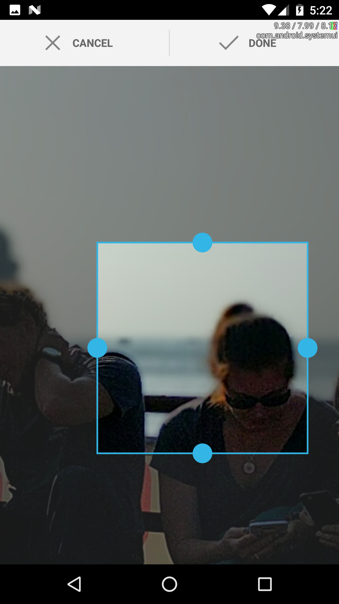

# cordova-plugin-crop

> Crop an image in a Cordova app


## Install

```
$ cordova plugin add --save https://github.com/qwerqwermhc/Crop/tree/master/cordova-plugin-crop
```


## Usage

```js
plugins.crop(function success () {

}, function fail () {

}, '/path/to/image', options)
```

or, if you are running on an environment that supports Promises
(Crosswalk, Android >= KitKat, iOS >= 8)

```js
plugins.crop.promise('/path/to/image', options)
.then(function success (newPath) {

})
.catch(function fail (err) {

})
```

## API

 * quality: Number

The resulting JPEG quality (ignored on Android). default: 100

 * targetWidth: Number

The resulting JPEG picture width. default: -1

 * targetHeight: Number

The resulting JPEG picture height. default: -1

## Ionic / Typescript Example Angular 2 Service



This is an example service that uses ionic-native's built in camera and the cordova-plugin-crop to create a cropped version of the image and return the file path. 

```js
import { Injectable } from '@angular/core';
import { Platform } from 'ionic-angular';
import { Camera, Crop } from 'ionic-native';

@Injectable()
export class CameraService {

  public options: any = {
        allowEdit: true,
        sourceType: Camera.PictureSourceType.SAVEDPHOTOALBUM,
        mediaType: Camera.MediaType.ALLMEDIA,
        destinationType: Camera.DestinationType.FILE_URI
  }
  
  constructor(public platform: Platform,private crop: Crop) {}

  // Return a promise to catch errors while loading image
   cropLogoPicture(imageURI) {
    if (this.platform.is('ios')) {
      imageURI;
    } else if (this.platform.is('android')) {
      // Modify fileUri format, may not always be necessary
      imageURI = 'file://' + imageURI;

      /* Using cordova-plugin-crop starts here */

    }
    return this.crop.crop(imageURI, {
      quality: 100,
      // targetHeight: 100,
      // targetWidth: 200,

      widthRatio: 200,
      heightRatio: 100,
    }).then(newPath => {
      return this.toBase64(newPath).then((base64Img) => {
        return base64Img;
      });
    },
      error => {
        console.log("CROP ERROR -> " + JSON.stringify(error));

      }
      );
  }
   toBase64(url: string) {
    return new Promise<string>(function (resolve) {
      var xhr = new XMLHttpRequest();
      xhr.responseType = 'blob';
      xhr.onload = function () {
        var reader = new FileReader();
        reader.onloadend = function () {
          resolve(reader.result);
        }
        reader.readAsDataURL(xhr.response);
      };
      xhr.open('GET', url);
      xhr.send();
    });
  }
  
}  
```


### Libraries used

 * iOS: [ios-crop](https://github.com/qwerqwermhc/Crop/tree/master/cordova-plugin-crop/src/ios)
 * Android: [android-crop](https://github.com/qwerqwermhc/Crop/tree/master/cordova-plugin-crop/src/android)


